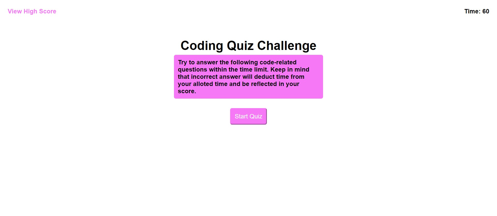

# Coding Qutix

This site features a quiz designed to test your coding knowledge. The quiz has a 60-second time limit, and a 10-second penalty is applied for each incorrect answer.

## Table of Contents

- [Features](#features)
- [Link-to-Webpage](#Link-to-Webpage)
- [Appearance](#Appearance)
- [About-Developer](#About-developer)
- 

## About-developer

Hi my name is Molaligne (Mola) Dafa. I am currently participating in a coding boot camp and this is my Second project. 
In it, I have attempted to demonstrate my skills in CSS and HTML.

## Features

- Scores saved in local storage
- Timed games
- - 
  
 
  
## Link-to-Webpage
- https://github.com/Mola90/Challenge-4-Coding-Quiz

## Appearance

The following image demonstrates the page's appearance
